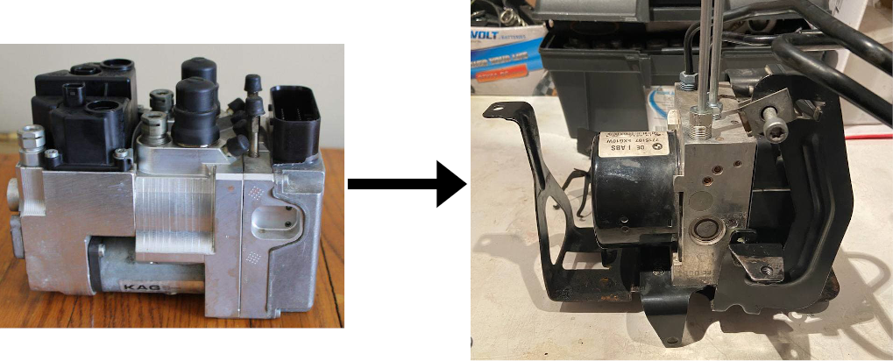
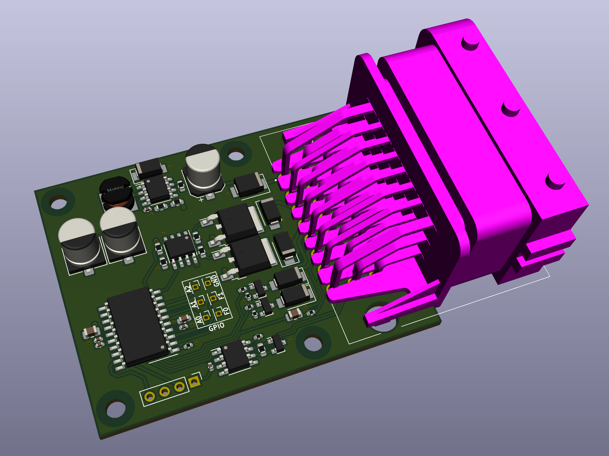
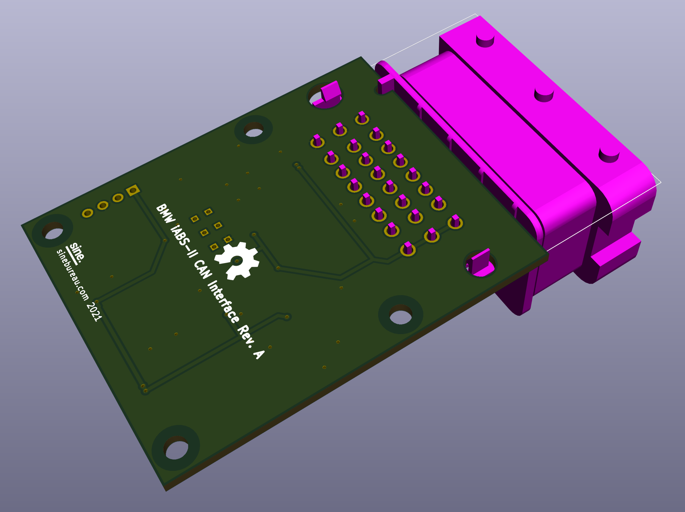

# BMW K1200LT iABS to iABS gen 2 Conversion PCB and Firmware.

To retrofit BMW K1200LT motorcycle we used the iABS-II module from 2010 R1200GS K25.  
iABS-II uses CAN bus to communicate with ZFE, DME modules in the original R1200GS schematic.  

This project is developed to provide K1200LT necessary signals from iABS-II CAN bus:
- Speed signal for K1200LT dash
- Brake and tail lights output
- ABS warning LED output
- General warning LED output  

<!-- 

 -->

## Other resources. 
[Shematics](docs/)

#### PCB is designed in KiCAD 5.1.9

## License

MIT
